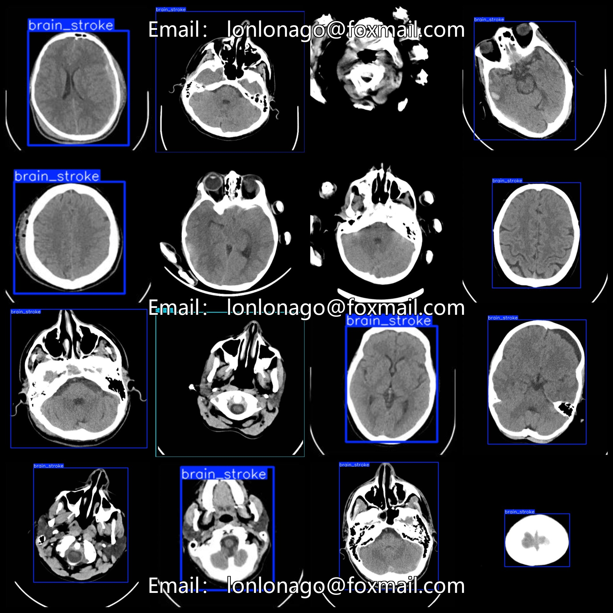
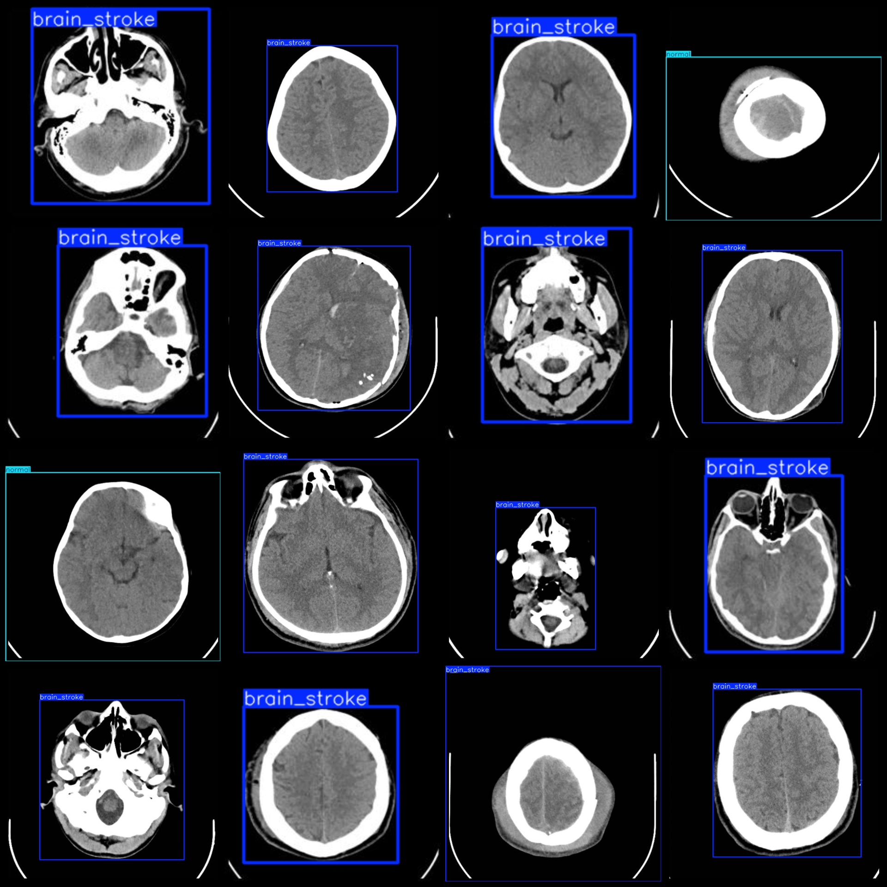

# Smart Medical MRI Brain Infarction Detection Dataset VOC+YOLO Format with 1793 Images in 2 Classes with Enhanced Images

Please note that the dataset contains many enhanced images (i.e., so-called duplicate images, which have been deduplicated by MD5 files).

Dataset format: Pascal VOC format + YOLO format (without split paths in the txt file, only containing jpg images along with corresponding VOC format xml files and YOLO format txt files)

Number of images (jpg file count): 1793
Number of annotations (xml file count): 1793
Number of annotations (txt file count): 1793
Number of annotation categories: 2
Annotation category names (note that the order of categories in the YOLO format does not correspond to this, but is based on the labels folder's classes.txt): ["brain_stroke", "normal"]
Number of bounding boxes per category:
brain_stroke = 1483
normal = 265
Total bounding boxes: 1748
Number of images each category occupies:
brain_stroke = 1482
normal = 265

Image resolution: 640x640

Using annotation tool: labelImg
Annotation rules: drawing bounding boxes for the categories

Important Notice: The dataset does not have a separate training/validation/test split; users are required to manually divide it.
Special Declaration: This dataset does not guarantee the accuracy of the trained models or weight files.

Image Preview:
Annotation Example:

## Images

Here is a pay link on Stripe ( https://buy.stripe.com/3cs8yP7sY87d0vu9AB ). Please contact me lonlonago@foxmail.com after funding $89, and I will send you a complete data files , thank you!

